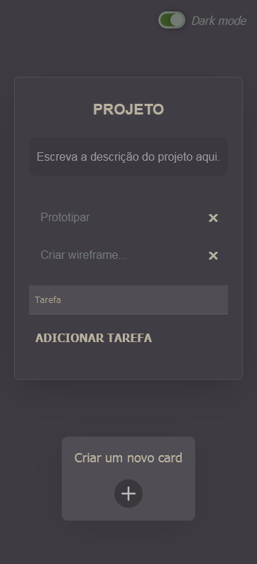

<h1 align=center>Backlog Angular</h1>

Aplicação moderna de backlog desenvolvida em Angular para auxiliar na organização de projetos, listando as tarefas pendentes em cartões com textos dinâmicos.

    
    

## Demonstração

Esta aplicação está sendo hospedada aqui no github através do *Github Pages*, você pode conferir o resultado e usar a aplicação neste link:

  - https://refusado.github.io/backlog-angular/

    
Vídeo para demonstração

    

## Angular

O projeto foi desenvolvido usando a versão 14.2.1. do Angular CLI.
